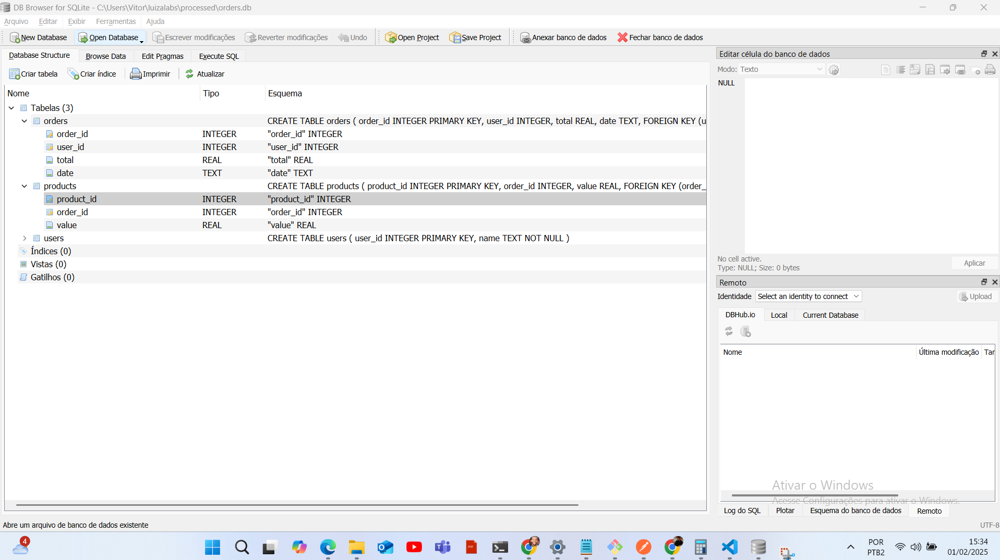

# Order Processing API

## Sumário

1. [Descrição](#descrição)
2. [Tecnologias Utilizadas](#tecnologias-utilizadas)
3. [Estrutura do Projeto](#estrutura-do-projeto)
4. [Configuração do Ambiente](#configuração-do-ambiente)
5. [Instalação de Ferramentas](#instalação-de-ferramentas)
6. [Como Executar](#como-executar)
7. [Endpoints](#endpoints)
8. [Testes](#testes)
9. [Logs](#logs)
10. [Contribuição](#contribuição)
11. [Autor](#autor)

## Descrição

Esta é uma API para processamento de pedidos, permitindo o upload de arquivos `.txt` contendo informações sobre pedidos, produtos e usuários, além de consultas aos dados armazenados em um banco SQLite.

##

## Tecnologias Utilizadas

- Python
- Flask
- SQLite
- Flask-MonitoringDashboard
- Unittest

## Estrutura do Projeto

LUIZALABS/
│
├── processed/                 # Pasta onde o banco de dados SQLite é armazenado
│   ├── orders.db              # Arquivo do banco de dados SQLite
│
├── src/                       # Diretório principal do código fonte
│   ├── api/                   # Diretório que contém a API
│   │   ├── controllers/       # Controladores da API
│   │   │   ├── api\_controller.py # Controlador da API
│   │   │   └── **init**.py    # Inicializador do pacote
│   │   ├── app.py             # Código principal da aplicação Flask
│   │   └── settings.py        # Configurações da aplicação
│   │
│   ├── config/                # Configurações da aplicação
│   │   ├── **init**.py        # Inicializador do pacote de configurações
│   │\
│   │
│   ├── services/              # Serviços da aplicação
│   │   ├── file\_processor.py  # Código para processar arquivos
│   │   └── **init**.py        # Inicializador do pacote de serviços
│   │
│   ├── tests/                 # Diretório de testes
│   │   ├── test\_api.py        # Testes para os endpoints da API
│   │   ├── test\_file\_processor.py # Testes para o processamento de arquivos
│   │   ├── data\_1.txt         # Arquivo de teste com dados formatados
│   │   └── invalid\_file.jpg   # Arquivo de teste inválido
│   │
│   ├── utils/                 # Utilitários da aplicação
│   │   ├── **init**.py        # Inicializador do pacote de utilitários
│   │   ├── database.py        # Funções de conexão com o banco de dados
│   │   └── logger.py          # Configurações de logging
│
├── uploads/                   # Diretório para uploads de arquivos
│
├── venv/                      # Diretório do ambiente virtual
│
├── .gitignore                 # Arquivo para ignorar arquivos no Git
├── app.log                    # Arquivo de log da aplicação
└── flask\_monitoringdashboard.db # Arquivo do banco de dados para monitoramento


## Instalação de Ferramentas

### 1. Postman

Baixe e instale no site oficial: [Postman](https://www.postman.com/downloads/)

### 2. SQLite

#### Windows

1. Baixe o SQLite: [https://www.sqlite.org/download.html](https://www.sqlite.org/download.html)
2. Extraia o arquivo em um diretório acessível.
3. Adicione o caminho do executável `sqlite3.exe` à variável de ambiente `PATH`.

## Configuração do Ambiente

### Windows

1. Criar e ativar o ambiente virtual:

```powershell
python -m venv venv
venv\Scripts\activate
```

2. Instalar dependências:

```powershell
pip install -r requirements.txt
```

### Linux/macOS

1. Criar e ativar o ambiente virtual:

```bash
python -m venv venv
source venv/bin/activate
```

2. Instalar dependências:

```bash
pip install -r requirements.txt
```

## Endpoints

### Health Check

```bash
curl --location 'http://localhost:5000/health'
```

### Upload de Arquivo

Substitua `<caminho_do_arquivo>` pelo caminho correto do arquivo no seu sistema.

#### Windows

```powershell
curl --location 'http://localhost:5000/upload' \
--form 'file=@"C:\\caminho\\para\\data_1.txt"' \
--form 'file=@"C:\\caminho\\para\\data_2.txt"'
```

#### Linux/macOS

```bash
curl --location 'http://localhost:5000/upload' \
--form 'file=@"/caminho/para/data_1.txt"' \
--form 'file=@"/caminho/para/data_2.txt"'
```

### Consultar Pedidos

```bash
curl --location 'http://localhost:5000/orders'
```

```bash
curl --location 'http://localhost:5000/orders?order_id=<id_do_pedido>'
```

## Testes

```bash
python -m unittest discover tests
```


## Saidas Endpoints

### 1. Health Check

- **GET** `/health`
- Verifica se a API está funcionando corretamente.

### 2. Upload de Arquivo

- **POST** `/upload`
- Envia um arquivo `.txt` para processamento.
- **Parâmetro:** `file` (arquivo .txt)
- **Exemplo de resposta:**

```json
{
  "message": "Arquivo processado com sucesso"
}
```

### 3. Consultar Pedidos

- **GET** `/orders`
- Retorna a lista de pedidos com produtos e usuários.
- **Parâmetros opcionais:** `order_id`, `start_date`, `end_date`
- **Exemplo de resposta:**

```json
[
  {
    "user_id": 1,
    "name": "João Silva",
    "orders": [
      {
        "order_id": 123,
        "total": 250.75,
        "date": "2023-05-12",
        "products": [
          {"product_id": 1001, "value": 150.50},
          {"product_id": 1002, "value": 100.25}
        ]
      }
    ]
  }
]
```


Os testes validam:

- O funcionamento do endpoint `/health`
- O upload de arquivos válidos e inválidos
- A consulta de pedidos no banco de dados


## Status health

Aqui está um exemplo de um Status health gerado pela aplicação:


## Estrutura do Banco de Dados

Aqui está uma visualização do banco de dados SQLite:




## Running

Aqui está uma visualização do Running do codigo na porta 5000:


## Exemplo de Resposta do GET /orders

Abaixo está um exemplo de resposta retornada pela API:


## Logs da Aplicação

Aqui está um exemplo de um log gerado pela aplicação:


## Logs

Os logs da aplicação são armazenados no arquivo `app.log`, registrando erros e informações importantes.

## Contribuição

Para contribuir, crie um branch, faça suas modificações e envie um pull request.

## Autor

Vitor Alexandre Paula da Silva

